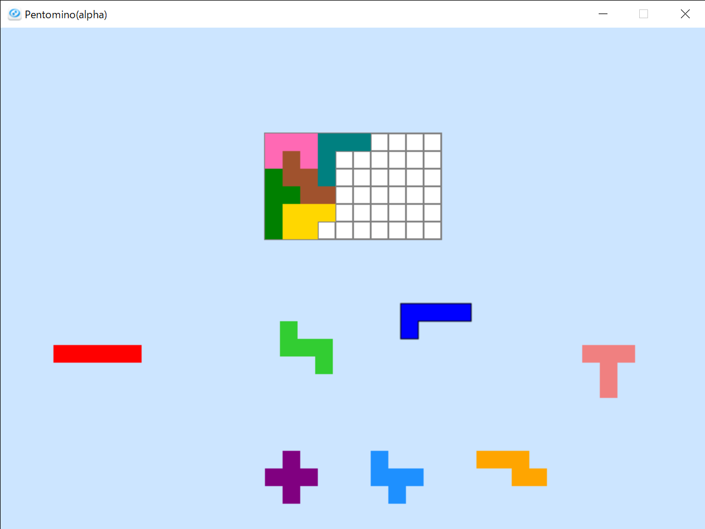

# pentomino

## 概要
ペントミノファームというパズルゲームをOpenSiv3D(C++で簡単にゲームが作れるフレームワーク)で実装したものです。いわゆるα版ですが、これ以上作るつもりは現状ないです。偉い人とかに自分がどのくらいのものを作れるのか正しく知ってもらうために公開しています。

## Usage/Requirement
- Microsoft Visual Studio Community 2019
Version 16.5.3

- OpenSiv3D v0.4.3

https://siv3d.github.io/ja-jp/ に従えば動かせるはず。

## サンプル

